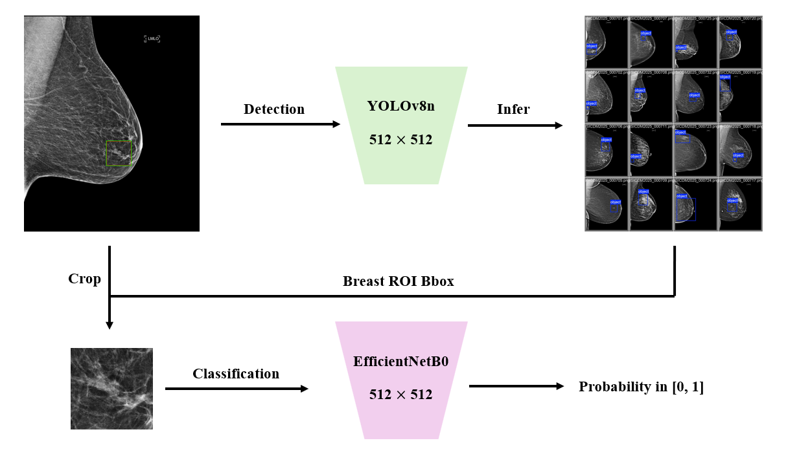
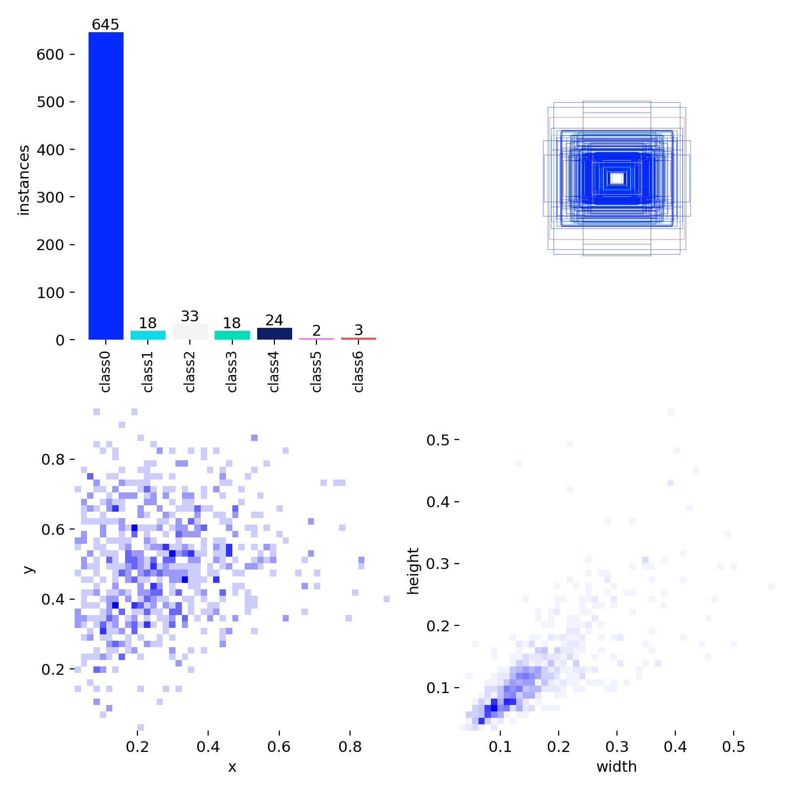
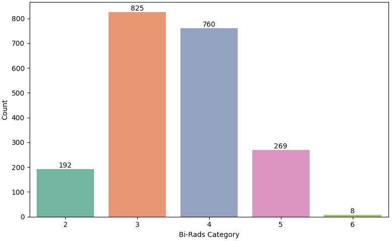
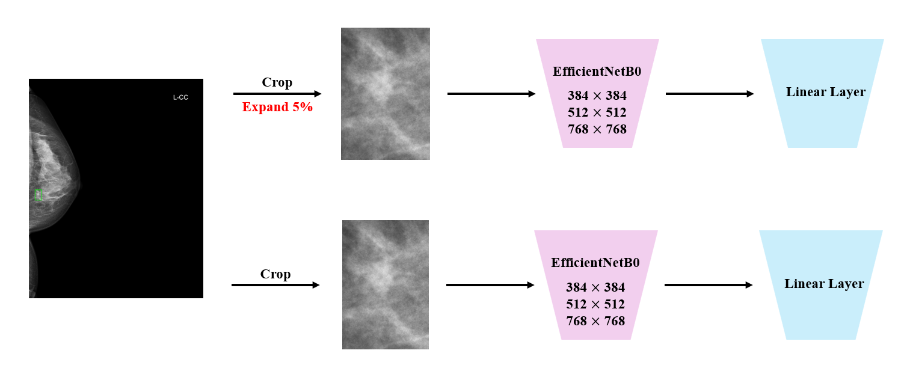
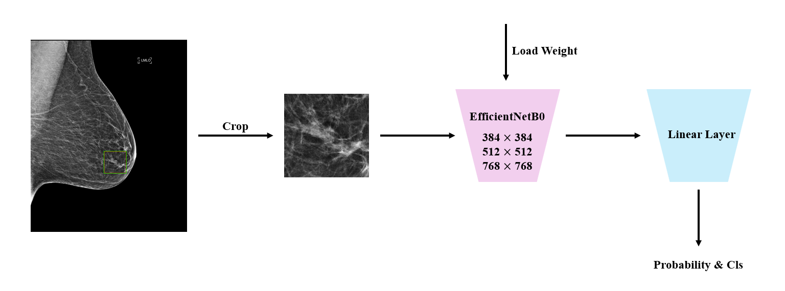
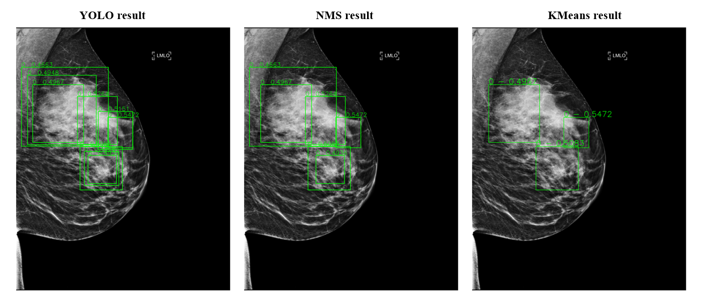
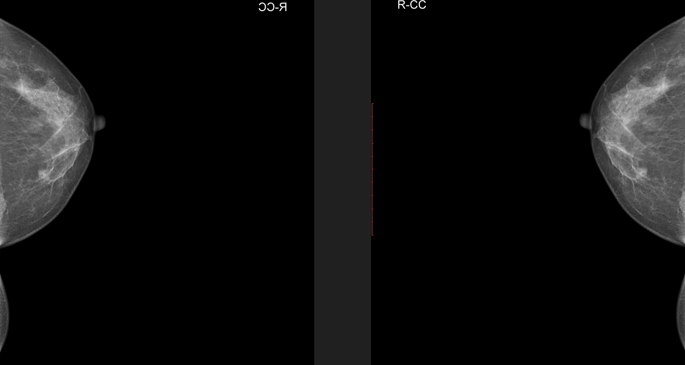

# ISICDM2025 Q4 Breast Cancer Detection Solution


*Update 10/04/2025*

- [Just Infer (Jupyter Notebook)](#just-infer-jupyter-notebook)
- [Infer and Visualize (Command)](#infer-and-visualize-command)
  - [Competition dataset](#competition-dataset)
  - [Local data](#local-data)
- [Fine-tune the model weight files trained from external data (Jupyter Notebook)](#fine-tune-the-model-weight-files-trained-from-external-data-jupyter-notebook)
- [SOME RESULTS ABOUT THIS COMPETITION](#some-results-about-this-competition)
  - [IMBALANCE!](#imbalance)
  - [model size](#model-size)
  - [Post process: NMS vs. unsupervised learning](#post-process-nms-vs-unsupervised-learning)
  - [Other Useful Strategy](#other-useful-strategy)


First of all, I would like to thank ISICDM and competition's host for such an amazing challenge, a lofty goal with high data quality.

I'm also very happy and surprised with entering the 2nd round and sharing my solution in ISICDM 2025. It was such a great journey for me. This solution is trained via 1 x Nvidia RTX5090, but in fact it will not cost more than 20Gb unless setting an unexcepted batch size. 1 x RTX3090 could repreduct result perfectly.

For the solution, I use a very simple pipeline which can be described in just few lines:

Use some external datasets: VinDr-Mammo、Inbreast.

**Some details:**

1. **VinDr-Mammo**: contains BIRADS scores for each image of 0-5. I treated BIRADS 5 as cancer (1) and all other as normal (0). With only Digital Mammograms and BIRADS categories, one can't confirm 100% if a case is cancer or not . BIRADS 4 indicate 30% chance of cancer, then I was treated it as normal. My decision only happen in just a few seconds as i could remember. Reading other posts, i'm feeling my decision is not as good, except that it helps reduce sensitivity and can "improve" the pF1 (I don't want to see it that way). Maybe I make a huge mistake here. Better solution is to use soft/uncertain label or pseudo labeling for these ambigous (BIRADS-4) cases instead. Some images has LUTDescriptor. The image look over-exposured when apply VOILUT (voi + windowing), so I just apply windowing on this dataset, equivalent to pydicom's `apply_voi_lut(prefer_lut = False)`
2. **Inbreast**: A New Breast MRI Database, University of Porto, Portugal, in collaboration with IPO (Portuguese Institute of Oncology), is a public mammography image dataset, mainly used for computer-aided diagnosis (CAD) research of breast cancer, especially in the detection and classification tasks of masses and microcalcifications.

Background detection and classification (head) model: YOLOv8n + EfficientNet-B0 validated on 5-folds splits of competition data. YOLO is trained by [ultralytics](https://github.com/ultralytics/ultralytics). EfficientNet is trained by [timm](https://timm.fast.ai/).



Now I want to share some experiments and my thought about those. Many of theme could be found in another discussions by excellent competitors. Many of theme seem obvious. Hope this helps some new comer getting started in the future. Kindly note that it's just my own opinion/thoughts with very limited experiments and knownledge. I'm appreciated for your discussions and feel free to correct me if something was wrong.

Before these sharing, I want to give you some more intuitive results.

**Note: .ipynb (Jupyter) files in `./notebooks/jupyter notebook`, .py (command) files in `./src`**

## Just Infer (Jupyter Notebook)

**Step1. Get ready for environment**

```
pip install -r requirements.txt
```

Some of the KEY REQUIREMENTS:

```python
torch=2.7.0+cu128
torchvision=0.22.0+cu128
ultralytics=8.3.194
timm=1.0.19
```

**Step2. Download the trained weight files we provide**

512_efficientnet_b0_fold_{1-5}.pth are the weight files for EfficientNetB0

512yolov8.pt is the weight file for YOLOv8

**Step3. Run inferring.ipynb, and modify the path in Config to your local path**

## Infer and Visualize (Command)

### Competition dataset

Prepare conda environment:

```python
pip install -r requirements.txt
```

Find and open Config.py, modify the default path to your local path:

```python
class Config():
    YOLO_WEIGHT_DIR = r"E:\ISICDM2025\yolo_weight"                   # YOLO weight path
    CLS_WEIGHT_DIR = r"E:\ISICDM2025\cls_weight"                     # EfficientNet weight path
    TEST_IMG_DIR = r"E:\ISICDM2025\ISICDM2025_images_for_test"       # Test data path
    csv_path = r"E:\ISICDM2025\infer-result.csv"                     # Infer result path
    infer_result_path = r"E:\ISICDM2025\infer-result.csv"            # Infer result path
    postprocess_output_path = r"E:\ISICDM2025\infer-result-postprocess.csv"  # Postprocess result save path
    output_json_path = r"E:\ISICDM2025\infer-result-postprocess_coco.json"   # coco result
```

Start inferring with anaconda prompt:

```python
python infer.py
```

It will create:

a  `.csv` file named `infer-result-postprocess.csv` referring to `Config.postprocess_output_path`

a `.json` file named `infer-result-postprocess_coco.json` referring to `Config.output_json_path`

Start visualization with anaconda prompt:

Multi-image display:

```python
python visul.py -m
```

Max 9 iamges could be displayed. Modify `Config.visual_gap` value to adjust the start number of displayed image. 

Single image display:

```python
python visul.py -i ISICDM2025_test_001.png
```

Replace `ISICDM2025_test_001.png` to any competition test image.

### Local data

Approach 1. Create a document to save your local data, and modify `Config.TEST_IMG_DIR `to your local path. The same goes for other `Config path`.

Approach 2. Delete the contents of `Config.TEST_IMG_DIR` and place the local data in this path （if you already have the document).

## Fine-tune the model weight files trained from external data (Jupyter Notebook)

512_efficientnet_b0_expand.pth is pretrained weight of head model from external data

512yolo.pt if pretrained pretrained weight of detection model from external data

**Step1. Follow *Just Infer (Jupyter Notebook) - Step1 and Step2*  to prepare the conda environment and weight files**

**Step2. Run efb-ft.ipynb, and modify the path in Config to your local path**

**Step3. Run yolo-ft.ipynb, and modify the path in Config to your local path**

## Visualization (Jupyter Notebook)

Run Visual.ipynb

## SOME RESULTS ABOUT THIS COMPETITION

### IMBALANCE!



There are too many Bi-Rads 0 compared to other categories, which is VERY IMBALANCE! To solve this problem, I chose to remove the classifier from the detection model, pre-train a powerful classification head on large-scale data, and then fine-tune it on this extremely imbalanced dataset. This approach has significant benefits: it allows the model to learn more characteristics of other categories, greatly enhancing the robustness of the model. Once this approach is chosen, the detection model can be optimized into a detector that only detects lesions (separating background and lesions) and does not need to identify different categories. I think these two core skills are the main reasons that led us to the rematch.



As mentioned earlier, the Bi-Rads 0 accounts for almost 90% of the competition data. From this, we infer that the private score will also have a similar data distribution. Considering that the external dataset is much larger than the training data provided by the competition, we did not use mixed data training (external dataset and competition dataset are used simultaneously in a single training phase) during training. Instead, we adopted a two-stage training strategy (first using the external dataset to adjust the distribution of model weight parameters and then using the competition dataset to fine-tune the model parameters). After experiments, the Bi-Rads 0 proportion in the inference results of mixed data training is much smaller than that of two-stage training. 

### model size

I use 384 x 384, 512 x 512, 768 x 768 for detector and classification model training. Detectors and convolution classifiers of different sizes can capture different details of medical images, and until the end I tried to figure out how to fuse the inference results of models of different scales.

| model size     | Stage            | image size | val_mAP50(7 cls) | val_mAP50(background) | val_Acc    | val_loss     |
| -------------- | ---------------- | ---------- | ---------------- | --------------------- | ---------- | ------------ |
| yolov8n        | External data    | 384        | -                | 24.20%                | -          | -            |
| yolov8n        | External data    | 512        | -                | 26.33%                | -          | -            |
| yolov8n        | External data    | 768        | -                | 31.57%                | -          | -            |
| yolov8n        | Competition data | 384        | **26.38%**       | 16.37%                | -          | -            |
| yolov8n        | Competition data | 512        | 6.06%            | **12.48%**            | -          | -            |
| yolov8n        | Competition data | 768        | 6.71%            | 10.03%                | -          | -            |
| EfficientNetb0 | External data    | 768        | -                | -                     | 60.83%     | 0.898200     |
| EfficientNetb0 | Competition data | 384        | -                | -                     | 85.71%     | 0.419585     |
| EfficientNetb0 | Competition data | 512        | -                | -                     | **91.07%** | **0.418896** |
| EfficientNetb0 | Competition data | 768        | -                | -                     | 90.62%     | 0.420984     |

Poor performance of minority classes will lower the overall mAP. As I said before, the detection model can be optimized into a detector that only detects lesions (separating background and lesions) and does not need to identify different categories, the mAP50 is greatly increased except 384 x 384.

### Model Training

**Stage1. Fine-tuning initial pretrained model**



**Stage2. Fine-tuning the VinDr-Mammo + Inbreast trained model**



### Post process: NMS vs. unsupervised learning

NMS is a common post-processing tool for target detection tasks, which reduces duplicate target boxes based on IoU. However, if all boxes are classified into the same category, NMS won't be particularly effective. This requires a strict setting of the IoU threshold (default 0.5). Observing the YOLO results, it's easy to see that the boxes are clustered, and the centers of densely overlapping boxes are almost identical. I believe it's the characteristics of these central overlapping areas that lead the algorithm to identify them as potential lesions. If these overlapping boxes are correctly classified, then they are all correct, because the highlighted area is precisely the central overlapping area. In other words, only the box with the highest confidence in the overlapping area needs to be retained. Therefore, choosing an unsupervised learning algorithm (Kmeans) to directly cluster the center points can perfectly solve this problem. Compared to the NMS parameter adjustment, the Kmeans algorithm directly obtains the classification result by calculating the distance between the center points.

However, the Kmeans algorithm requires manual selection of the number of clusters for classification. There are two approaches:
**Idea 1**: Initially set a large number of clusters for initial screening, then use NMS to refine the search using IoU filtering.
**Idea 2**: To complete unsupervised learning.

Here I prefer to Idea 2.

I choice a silhouette method.

$$
a(i)=\frac{1}{|c_i|-1}\sum_{j \in c_i,j \notin i}d(x_i,x_j)
$$

$$
b(i)=min_{k \notin c_i}(\frac{1}{|c_k|}\sum_{j \in c_k}d(x_i,x_j))
$$

$$
s(i)=\frac{b(i)-a(i)}{max\{a(i),b(i)\}}, s(i) \in [-1,1]
$$

$$
S = \frac{1}{n}\sum_{i=1}^ns(i)
$$

When S get max value, the cluster is in its best distribution. 




### Other Useful Strategy

```
transforms.Normalize(mean=MEAN, std=STD)
```

1. Manual calculation of normalization parameters instead of empirical parameters.

2. Normalize CT images to the [0, 255] pixel range.

3. Flip the external dataset left and right so that all breast images are on the left, consistent with the competition data.

4. Image enhancement based on picture window data , for example VOILUT.

   

   
